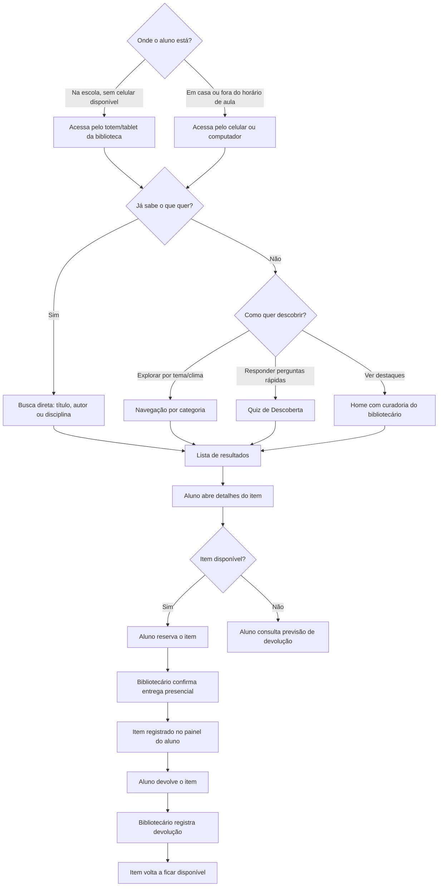
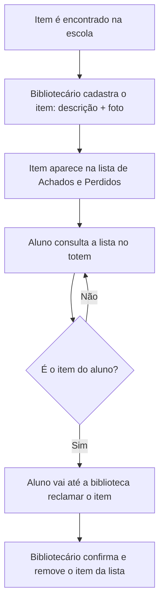
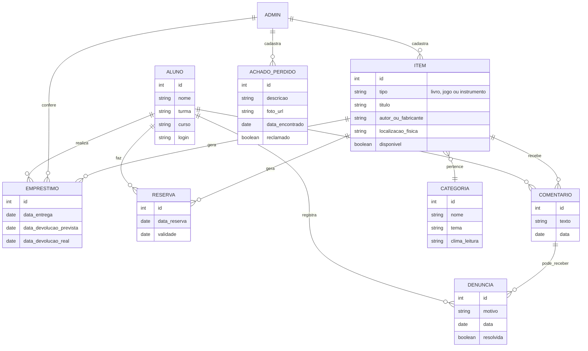

# 🏗️ Arquitetura e Modelagem — CTBJeca

Este documento reúne a modelagem inicial da solução: fluxo de uso e modelo de dados. Os diagramas usam [Mermaid.js](https://mermaid.js.org/), renderizado automaticamente pelo GitHub ao abrir este arquivo.

---
**Link: Cartões no TRELLO https://trello.com/b/1KPuoH9i/ctbjeca-planejamento**
---
## 1. Fluxograma de Uso (Aluno)

Caminho do aluno dentro do sistema, cobrindo tanto quem já sabe o que quer (busca direta) quanto quem não sabe (descoberta).

---

## 2. Fluxograma de Uso (Achados e Perdidos)

---

## 3. Modelo de Dados (Simplificado)

Entidades principais e como se relacionam.

---

## Ferramentas utilizadas

Todos os diagramas foram feitos em **Mermaid.js**, integrado nativamente ao GitHub — não é necessário nenhum software externo para visualizá-los, bastando abrir este arquivo no repositório.

**Professor, gostaria de informar que a estrutura e o código/texto deste projeto foram gerados pelo assistente Claude AI (Anthropic), sob minha total orientação.**
